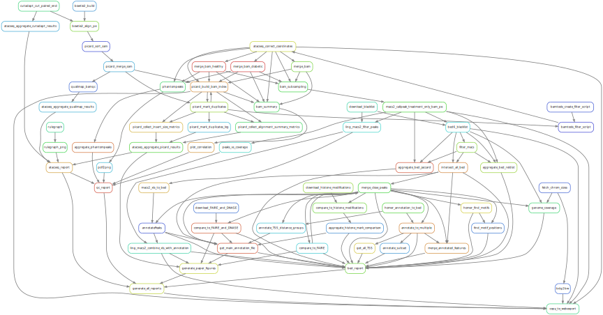

# Guest post: Snakemake Input Functions

## Workflows can get really complex

If you turn your entire analysis project into a Snakemake workflow, you may end up with something like this.

|  | 
|:--:| 
| [Leif Wigge, Rasmus Ågren and John Sundh SciLifeLab, National Bioinformatics Infrastructure Sweden (NBIS), Bioinformatics Long-term Support, MIT License](https://nbis-reproducible-research.readthedocs.io/en/course_1911/snakemake/) |

Sometimes, the standard Snakemake wildcard matching logic is not enough to express the connections you need
to make, especially with complex combining steps. In these cases we can use **input functions**. Before
seeing how these work, we need to talk about Python functions in general.

## Python functions in general

You've likely made use of utility functions like `expand()` and `glob_wildcards()` in writing Snakefiles. These
are actually Python functions, but you don't really need to know this to make use of them. Writing your own
function does require more knowledge of Python syntax, so here is a quick refresher on how they work.

Functions in Python look like this:

~~~
def myfunc(arg1, arg2):
    """Return a pair greetings for the two individuals specified.
    """
    result = expand( "Hello {x}", x = [arg1, arg2] )
    return result
~~~
{: .language-python}

There are many things to note in these lines:

* The keyword `def`, as well as the parentheses and the colon, are always used when defining a Python function
* As with rules, the function has a name of our choosing - `myfunc`
* The function has *arguments*, ie. placeholders for values to pass in, which are also named - `arg1` and `arg2`
* The function body is indented and consists of one or more Python statements to be run when the function is called
* It's good practise to put a comment at the top, saying what exactly this function does
* The body may set *local variables* - here `result` - which can only be referenced within the function
* Other functions may be called within the function body - here `expand()`
* The keyword `return` exits the function with a result

The simplest way to test the function is to put it in a file and run it with Snakemake. We'll use a couple of `print()`
lines to call the function and show the result.

~~~
# Save as myfunc_test.py then run "snakemake -n -s myfunc_test.py"
def myfunc(arg1, arg2):
    """Return a pair greetings for the two individuals specified.
    """
    result = expand( "Hello {x}", x = [arg1, arg2] )
    return result

print( myfunc("you", "me") )
print( myfunc("everyone here", "nobody in particular") )
~~~
{: .language-python}

Having put the above lines into `myfunc_test.py`, we see that each time the function is called it produces a 2-item list,
lists of things being denoted by square bracket notation.
Since there are no rules in this file, Snakemake has nothing to put in the DAG and so it stops after running the two `print()`
statements.

~~~
$ snakemake -n -s myfunc_test.py
['Hello you', 'Hello me']
['Hello everyone here', 'Hello nobody in particular']
Building DAG of jobs...
Nothing to be done.
~~~

> ## Note
>
> You could also run the above file directly in Python - `$ python3 myfunc_test.py` - but to make it work you'd
> also need to add the line
>
> ~~~
> from snakemake.io import expand
> ~~~
>
> to the top. When the code is run via Snakemake this utility function, among other things, are imported for you.
>
{: .callout}

## Input functions in Snakemake

Snakemake's normal way of calculating the inputs to a rule involves plugging wildcards into fixed templates. In most
cases, you can (and should) use carefully chosen file naming to make this work, but in some cases there is no way
to do it while keeping the rule generic.

A typical example would be a combining rule where the number of things to combine is not fixed. Imagine we had these
input files.

~~~
$ tree reads/
reads/
├── control_A
│   ├── r0.fasta
│   └── r1.fasta
├── control_B
│   ├── r0.fasta
│   └── r1.fasta
├── high_conc
│   ├── r0.fasta
│   ├── r1.fasta
│   ├── r2.fasta
│   └── r3.fasta
└── low_conc
    ├── r0.fasta
    ├── r1.fasta
    ├── r2.fasta
    └── r3.fasta
~~~
{: .language-bash}

And we want to merge them by sample.

~~~
rule merge_reads_for_sample:
    output: "merged_{sample}.fasta"
    input:  expand("reads/{{sample}}/r{n}.fasta", n=[0,1,2,3])
    shell:
        cat {input} > {output}
~~~
{: .language-python}

This rule will work for the `high_conc` and `low_conc` samples but for the `control` samples Snakemake
will complain about missing input files. We need a different expansion depending on the value of `{sample}`,
and this is what an input function can do for us.

~~~
def i_reads_for_sample(wildcards):
    """Input function for merge_reads_for_sample rule. Our control libraries
       have 2 reads and the others all have 4.
    """
    sample_name = wildcards.sample

    if sample_name.startswith("control_"):
        reads_in_sample = [0,1]
    else:
        reads_in_sample = [0,1,2,3]

    return expand("reads/{sample}/r{n}.fasta", sample = sample_name,
                                               n = reads_in_sample)

rule merge_reads_for_sample:
    output: "merged_{sample}.fasta"
    input:  i_reads_for_sample
    shell:
        cat {input} > {output}
~~~
{: .language-python}

Looking at this line by line:

* The function is named `i_reads_for_sample`.
  * I prefer to prefix my input functions with `i_` but this is not a widespread Snakemake convention
  * The function has to be defined before the rule
  * All input functions take a single argument which is conventionally named `wildcards` or `wc`
* The value from `wildcards.sample` is copied to a local variable `sample_name`
* An `if`/`else` statement is used to work out the correct number of reads for this particular sample
* Finally, the `expand()` function gives the full list of input files needed for this sample
  * Note that I have had to explicitly add `sample = sample_name` here in the expansion as Snakemake
    will no longer fill this in for me.
* The rule now has the line `input:  i_reads_for_sample`. Note there are no paretheses or quotes but
  just the bare function name.

The example is a little contrived, but illustrates all the key points. When Snakemake reads the rule
definition it saves a reference to the function but does not call it yet. Only once it goes to make the
rule into a job, and therefore knows the wildcard values form that job, does it actually call the
function to get the real input files. Any rule may be used to construct multiple workflow
jobs and Snakemake calls the input function for each of these jobs. Contrast this with the first definition
of the rule where the `expand(...)` expression would be evaluated immediately, and only once, to make
a fixed input template.

In a real workflow we might put some more flexible logic into the function such as using `glob_wildcards()`
to dynamically scan for input files per sample, or have a config file to set the number of inputs per sample.
The input functions can get as complex as you need, and incorporate any amount of Python logic.

## Making a tournament bracket with input functions

We'll now show the power of input functions by doing something less common but more interesting. The idea is
that we need to combine a big list of files but this time our combiner application can only merge two files
at once, for some reason. We need to adopt a recursive strategy where we merge pairs of files, then merge
the results, and keep going until we have a single final result. And this should all be realised as a Snakemake
DAG so that Snakemake can run jobs in parallel, resume partial runs, etc.

It turns out this logic is analagous to running a tournament bracket, where rather then merging the pairs of
inputs we pick the "winner" from each pairing until we get a final "champion" result. So we'll
generate a collection of ["top trumps"](https://en.wikipedia.org/wiki/Top_Trumps)
cards, then play a knockout tournament to find the winner. Unlike the
previous section, this is a full example that you can run for yourself.

[Here is the code you will need.](/assets/zip/tournament.tar.gz)

First, generate our "top trumps" player cards.

~~~
$ ./generate_cards.py 8
Generating 8 cards in ./all_cards/
DONE
$ ls all_cards
card_1.json  card_3.json  card_5.json  card_7.json
card_2.json  card_4.json  card_6.json  card_8.json
$ cat all_cards/card1.json
{
  "Name": "Gil Annor",
  "Speed": 140,
  "Endurance": 4.2,
  "Power": 93,
  "Skill": 31
}
~~~

You'll see a different name and stats as the generator is randomised.
Now we can match any two of these players to see who wins.

~~~
./play_a_match.py all_cards/card_1.json  all_cards/card_2.json
Matching Gil Annor vs Kennel Timwick.
The criterion is: Highest Skill.
Winner is Kennel Timwick with 79 vs 31.
{
  "Name": "Kennel Timwick",
  "Speed": 120,
  "Endurance": 7.4,
  "Power": 60,
  "Skill": 79
}
~~~

The match-up script simply picks a random category, compares the corresponding values and prints out
the winning card, so how do we get Snakemake to orchestrate a tournament of multiple matches
for us? The idea is to use a recursive algorithm where the tournament of 8 is split into two
sub-tournaments of 4, and each of these in turn is two sub-sub-tournaments of 2.
Of course, a tournament of 2 is simply a single match, so this is the base case. If we have
all the players in a list, it looks like this, because Python lists count from 0:

~~~
players = [ "card_1",  # index 0
            "card_2",  # index 1
            "card_3",  # index 2
            "card_4",  # index 3
            "card_5",  # index 4
            "card_6",  # index 5
            "card_7",  # index 6
            "card_8" ] # index 7
~~~
{: .language-python}

The players could be listed in any order, and the order of the list determines how the player
cards are paired up in the tournament.
By the Python convention of sub-list indexing we'll call the match between card_1 and card_2 `[0:2]`,
the match between card_3 and card_4 `[2:4]`, and the match between the winner of those is `[0:4]`. Then
the other semi-final is `[4:8]` and the very final match is `[0:8]`. This scheme works for any number of
starting cards. The logic this leads us to is:

~~~
# Pseudo-code for building the tournament plan.
# Starting with the final, range=[0:8], recurse back until we hit first round matches

player_count = range_end - range_start

if player_count > 2:
    # This is a final or semi-final. Find the midpoint of the list and generate 2 sub-ranges,
    # then recurse. Eg. for [0:8] we play the winners of [0:4] and [4:8].
    midpoint = mean of range_start and range_end
    match winner of match [{range_start}:{midpoint}] vs.
          winner of match [{midpoint}:{range_end}]
else:
    # This is first-round match between two players
    match players[range_start] vs.
          players[range_start+1]
~~~

This idea will work for 8, 16, 32, players etc. We can handle all the cases where the number is not a power of 2
by adding a third condition.

~~~
# More pseudo-code

if player_count == 3:
    match winner of match [{range_start+1}:{range_end}] vs.
          players[range_start]
~~~

This resolves a range like `[0:3]` by playing two of the players against each other and then matching the
third one against the winner. The effect is that some of the players will get a bye in the first round of the
tournament if there are not 2n players. The total number of matches in the tournament will in all cases be one
fewer then the total number of players.

Because every tournament match is now uniquely identified by two numbers, we can save the results of
every match into a file named `matches/{start}-{end}.json`. The champion will be saved to
`matches/0-8.json`, or whatever number corresponds to the length of the list of players.

And so here is the final Snakefile implementing these ideas. I've added a `glob()` expression to scan
for the input files, a driver rule to show the winner, and a rule to play individual matches. I've
translated the pseudo-code above into working Python and put it into an input function.

~~~
from glob import glob

# Each "player" is one top trumps card, represented as a JSON file.
ALL_PLAYERS = sorted(glob("all_cards/card_*.json"))
assert len(ALL_PLAYERS) > 1, "Run generate_cards.py to make some input files."

def i_play_match(wildcards):
    """Given start and end indexes, work out the matches that must be played
       to resolve this part of the tournament bracket.
    """
    # Find the range from "matches/{start}-{end}.json"
    range_start = int(wildcards.start)
    range_end = int(wildcards.end)
    player_count = range_end - range_start

    # Sanity check. We should always have at least 2 players here.
    assert player_count >= 2

    if player_count == 2:
        # First round match between two input card files
        return [ ALL_PLAYERS[range_start],
                 ALL_PLAYERS[range_start+1] ]
    elif player_count == 3:
        # Only occurs if len(ALL_PLAYERS) is not a power of 2
        # Match the second and third players and give the first a bye to the second round.
        return [ f"matches/{range_start+1}-{range_end}.json",
                 ALL_PLAYERS[range_start] ]
    else:
        # Given four or more players to match up, split the range to trigger recursion
        midpoint = range_start + (player_count // 2)
        return [ f"matches/{range_start}-{midpoint}.json",
                 f"matches/{midpoint}-{range_end}.json" ]

# Default rule to crown the final winner
rule champion:
    input:  "matches/0-{}.json".format(len(ALL_PLAYERS))
    shell:
        "echo 'And the winner is...' ; cat {input}"

rule play_match:
    output: "matches/{start}-{end}.json"
    input:  i_play_match
    shell:
        "python3 play_a_match.py {input[0]} {input[1]} > {output}"
~~~
{: .language-python}

<figure>
  
  <figcaption><em>
    DAG generated by the final Snakefile for an 8-player tournament.
  </em></figcaption>
</figure>

And we run it:

~~~
$ snakemake -F -j1
...
Job counts:
    count   jobs
    1   champion
    7   play_match
...
And the winner is...
{
  "Name": "Congal Anndelwick",
  "Speed": 131,
  "Endurance": 3.4,
  "Power": 57,
  "Skill": 96
}
...
~~~

Well done, Congal Anndelwick! Having played a tournament of 8 players, we can generate a bunch more cards to put the workflow
though its paces, and we can try using the `-j` flag to run early rounds in parallel. On my laptop, a
tournament of 250 takes around 15 seconds, but this drops to 5 seconds by using `-j 8`. Of course most of the
time here is spent starting and stopping the Python interpreter. If the matches were
actually taking real time to process, for example by simulating a game between the players rather than just
comparing numbers, the advantage of running in parallel could be very significant.

[fig-spaghetti]: /assets/fig/rulegraph_complex.svg

Leif Wigge, Rasmus Ågren and John Sundh SciLifeLab, National Bioinformatics Infrastructure Sweden (NBIS), Bioinformatics Long-term Support
https://nbis-reproducible-research.readthedocs.io/en/course_1911/snakemake/
MIT License
